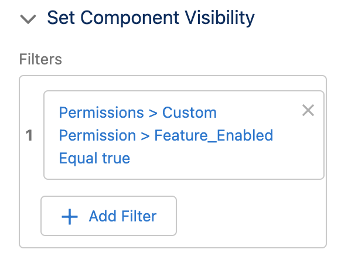
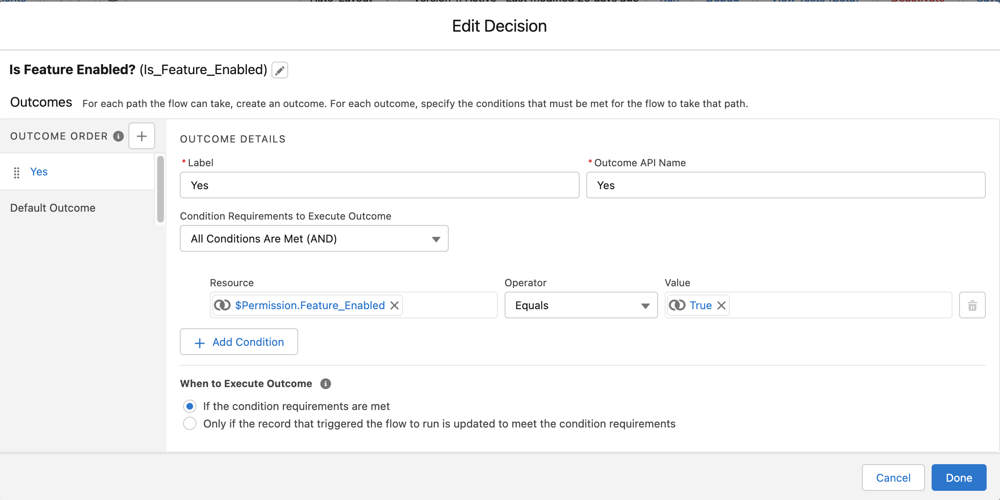

# Feature Flag POC

This repository contains a number of patterns for handling feature flagging within Salesforce. The idea centralises around a single mechanism to controll access to all facets of a feature on the Salesforce platform, including configuration (eg fields/flows) and code. For that reason Custom Permissions are used as the base, which are then assigned to a permission set and assigned to users to enable the feature. For communities Audiences also have to be used to enable the feature.

This repo can be easily pushed to a scratch/developer environment to help with understanding. Otherwise the patterns can be copied and adjusted as appropriate to fit your requirements.

There are a number of scripts written below to toggle the feature on or off, run some of the example code (through apex anonymous) and fully enable a feature (ie assign to all users) and finally to execute a rest request against a class, that has been disabled via the permission set.

## Approach
As mentioned above, the primary approach for hadling the feature dormancy will be through the usage of permission sets, these will control all access to fields an objects nessisary for the feature, and a custom permission that can then be used as a boolean flag in any coded or configuration of the system.
It is worth noting that the feature flagging should be used as a last resort, where sprint planning should be the favored approach, where if a feature doesn't need to be in production, it doesn't get built. But in the cases where it is nessiary (for example building a complex feature that requires coordination of multiple teams and systems, or a new regulation which is build ahead of the regulation going ahead to reduce risk on the regulation date), in these cases the feature flag can be used, but there should be explicit actions (in the way of a story being added to the backlog) to unpick the feature flag, so as to reduce the technical debt over time.

### Flag Configuration
To setup the feature flag you will need 2 main configurations, or potentially a third if configuring for an Experience Cloud Community. Those are:
* Custom Permission
* Permission Set
* Audience (for Experience Cloud)

Custom Permissions are simple in configuration, all they need is a name (and a label), which should be something appropriate to the feature that is being enabled, followed by the word enabled, eg
`My_Feature_Enabled`
Example: [Feature_Enabled](force-app/main/default/customPermissions/Feature_Enabled.customPermission-meta.xml)

A matching Permission Set should then be enabled to match the Custom Permission, this can follow the same naming convention as the Custom Permission. Once the permission set is created you will need to add the custom permission by going to Apps>Custom Permissions in the permission set configuration.
Example: [Enable_Feature](force-app/main/default/permissionsets/Enable_Feature.permissionset-meta.xml)

Finally, if community visibility is required for the feature, you will need to setup an Audience for the feature, this can be done by selecting Permission > Custom > <your custom permission name> when adding the criteria type, then entering operator as "equals" and value to "true".
Example: [Feature_Enabled](force-app/main/default/audience/Feature_Enabled.audience-meta.xml)
### Patterns
#### Community Visibility
As mentioned above an audience needs to be added to control visibility of components or even pages. To handle this you have to assign each component to the audience as shown below

Page variations can also be used to control feature visibility, but component visibility should be favored where possible due to it being easier to manage (as opposed to managing 2 seperate pages).

#### Lightning Page
Similar to community visibility, you can control the access to components on a lightning page by defining criteria. The difference here with communities is we can directly refrence the custom permission. This can be done by going to the "Set Component Visibility" section once a component is selected. See below:

#### LWC
For UI customisations you can also control the visibility within a lightning component. Although where possible the above 2 approaches should be favored as they introduce less technical debt. The checks within an LWC (or Aura component for that matter) are a boolean flag included within the component. These can be accessed by importing the custom permission
`import hasPermission from '@salesforce/customPermission/Feature_Enabled'`
Example: [featureFlagTest.js](force-app/main/default/lwc/featureFlagTest/featureFlagTest.js)

*Note: no example for Visualforce/Aura has been provided as any new features should be prioritised for build in LWC*
#### Layouts
As layouts primarily hold the fields that are required differnces should be managed through the usage of field level security in the permission set (more details later). If there are larger component differnces or changes in the layouts the usage of Lightning pages and componet visibility (mentioned above) should be used.
#### Flow
To handle feature flagging in Flows we can use a decision node, checking the criteria of the custom permission. See below:


For the detials of the decision criteria, see below:


For the example code see [Feature Flag Test Flow](force-app/main/default/flows/Feature_Flag_Test.flow-meta.xml)

*Note: other configuration based automation tools (ie process builder and workflow) have not been considered as part of these examples due to the deprecation plan for these*

#### Fields/Objects
Fields and objects that are required for a feature flag can be included in the permission set directly. As seen in [Enable_Feature](force-app/main/default/permissionsets/Enable_Feature.permissionset-meta.xml). It is worth noting that a required field cannot be left dormant if this is required as part of a feature, as once this is applied to a field this will enforce the field being available for all profiles and permission sets. If this is the need in a feature flag, the need for feature flagging it should be reconsiddered.

#### Validation Rules
Validation rules can be checked with a simple boolean check in an "and" logical check with the rest of the criteria. This should be included at the front of the validation rule to ensure it is first evaluated, and should be included using the `&&` operator over the `AND()` function call, as it is much easier to remove the one line with `&&` rather than finding where the end of the `AND()` is applied.
For example:

```
$Permission.Feature_Enabled &&
ISCHANGED(Name)
```
[Name Change Validation Rule](force-app/main/default/objects/Account/validationRules/Name_Change_with_Feature_Enabled.validationRule-meta.xml)

#### Code (Apex classes/triggers)
The simplest approach for handling feature flagging in code is a boolean statement check using the standard `FeatureManagement` classes `.checkPermission(String)` method. This can be seen in the [Account Trigger](force-app/main/default/triggers/AccountTrigger.trigger).

You can also define the access to classes at the permission set level, this is useful in cases like Apex Rest. See in the [Enable_Feature](force-app/main/default/permissionsets/Enable_Feature.permissionset-meta.xml) permission set for details of the `classAccesses` node.

Finally, you can also utilise branching by the usage of abstract classes where the logic becomes larger and more complex. This can also utilise factories to handle the instansiation. The idea behind this pattern revolves around defining an abstract class which contains a method for the execution of the code (or multiple methods depending on the complexity of the feature), this can then be instansiated after performing a boolean check against the custom permission. See [FeatureFlaggingExample.cls](force-app/main/default/classes/FeatureFlagExample.cls).
